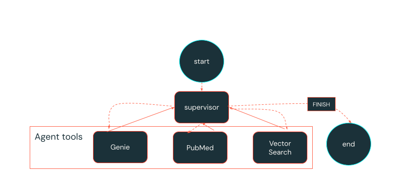

# Clinical Research Multi-Agent System Workshop

A comprehensive workshop project demonstrating advanced AI agent development using Databricks, MLflow, and LangGraph for clinical research data analysis. This system combines structured clinical trial data, document retrieval, and biomedical literature search capabilities through a sophisticated multi-agent architecture.

## 🎯 Overview

This workshop teaches you how to build a production-ready multi-agent system that can intelligently route queries across different data sources and provide comprehensive clinical research insights. The system orchestrates specialized agents through a supervisor to deliver contextual answers from:

- **Structured Clinical Data** - Querying clinical trial databases with natural language
- **Internal Documents** - Searching clinical trial documentation and metadata
- **Biomedical Literature** - Accessing PubMed research papers and studies



## 🏗️ Architecture

The system uses a supervisor-based multi-agent pattern with intelligent routing:

```
User Query → Supervisor Agent → [Genie | Retrieval | PubMed] → Final Answer
```

### Core Agents

- **🧞 Genie Agent**: Queries structured clinical trials data using Databricks Genie
- **📄 Retrieval Agent**: Searches internal clinical trial documents via vector search
- **📚 PubMed Agent**: Searches biomedical literature for peer-reviewed research
- **🎯 Supervisor Agent**: Routes queries and manages workflow (max 3 iterations)

## 📚 Workshop Notebooks

### [00_generate_agent_config.py](notebooks/00_generate_agent_config.py)
**Agent Configuration Generator**
- Creates consistent configuration files with Unity Catalog paths
- Maintains single source of truth for catalog and schema names
- Ensures proper agent.py configuration

### [01_author_multi_agent.py](notebooks/01_author_multi_agent.py)
**Multi-Agent System Implementation**
- Complete LangGraph-based multi-agent system
- MLflow integration for model serving and tracking
- Clinical research data analysis workflows
- Agent orchestration and state management

### [02_mlflow_dspy_prompt_optimization.py](notebooks/02_mlflow_dspy_prompt_optimization.py)
**Prompt Optimization with DSPy**
- MLflow's `optimize_prompt()` API with DSPy's MIPROv2 algorithm
- Automated prompt improvement for better performance
- Integration with MLflow Prompt Registry
- Comprehensive evaluation metrics

### [03_bonus_optimise_full_RAG_dspy.py](notebooks/03_bonus_optimise_full_RAG_dspy.py)
**Advanced RAG Optimization** (Bonus Content)
- Full RAG pipeline optimization using DSPy
- Advanced retrieval and generation techniques
- Performance tuning and evaluation

## 🚀 Getting Started

### Template Setup

This project serves as a template for building multi-agent systems. Before running the workshop, you'll need to configure the following placeholders:

#### 1. Configuration Files
Update the configuration files in `config/` with your specific values:

**`config/agent_config.yaml`:**
```yaml
LLM_ENDPOINT_NAME: databricks-meta-llama-3-3-70b-instruct  # Your LLM endpoint
VECTOR_CATALOG: agents_workshop                            # Your Unity Catalog name
GENIE_SPACE_ID: <your_genie_space_id>                     # Your Genie Space ID
```

**`config/agent_config_mlflow_optimized.yaml`:**
- Update the `GENIE_SPACE_ID` placeholder
- Update the `VECTOR_CATALOG` to match your catalog
- Update MLflow prompt URIs to match your workspace

#### 2. Databricks Bundle Configuration
Update `databricks.yml` with your workspace details:
```yaml
targets:
  dev:
    workspace:
      host: <your_workspace_host>  # Your Databricks workspace URL
  prod:
    workspace:
      host: <your_workspace_host>  # Your Databricks workspace URL
      root_path: /Workspace/Users/<user>/.bundle/${bundle.name}/${bundle.target}
    permissions:
      - user_name: <user>  # Your username
        level: CAN_MANAGE
```

#### 3. Secret Scope Configuration
Update the secret scope name in `notebooks/01_author_multi_agent.py`:
```python
secret_scope_name = "your_secret_scope"  # Replace with your actual secret scope
```

#### 4. Genie Space ID
To find your Genie Space ID:
1. Navigate to your Databricks workspace
2. Go to the Genie interface
3. Copy the Space ID from the URL or settings
4. Replace `<your_genie_space_id>` in all configuration files

#### 5. Required Secrets Setup
Create the following secrets in your Databricks workspace secret scope:
```bash
databricks secrets put-secret <your_secret_scope> PAT_token
databricks secrets put-secret <your_secret_scope> Genie_host
```

### Prerequisites

1. **Databricks CLI**: Install from [Databricks CLI documentation](https://docs.databricks.com/dev-tools/cli/databricks-cli.html)

2. **Authentication**: Configure your Databricks workspace
    ```bash
    databricks configure
    ```

3. **Required Secrets**: Set up the following secrets in your Databricks workspace:
   - `PAT_token`: Personal Access Token for Genie integration
   - `Genie_host`: Databricks Genie host URL

### Quick Start

1. **Deploy the project**:
    ```bash
    # Development deployment
    databricks bundle deploy --target dev
    
    # Production deployment  
    databricks bundle deploy --target prod
    ```

2. **Run the configuration generator**:
   - Open `notebooks/00_generate_agent_config.py`
   - Set your catalog and schema parameters
   - Execute to generate configuration files

3. **Build your multi-agent system**:
   - Follow along with `notebooks/01_author_multi_agent.py`
   - Learn agent orchestration patterns
   - Deploy your agents with MLflow

4. **Optimize your prompts**:
   - Use `notebooks/02_mlflow_dspy_prompt_optimization.py`
   - Leverage automated prompt optimization
   - Track improvements in MLflow

### Configuration

The system uses YAML configuration files located in `config/`:

- **`agent_config.yaml`**: Main configuration for agents, endpoints, and prompts
- **`agent_config_mlflow_optimized.yaml`**: Optimized configuration from DSPy tuning

Key configuration sections:
- LLM endpoints and models
- Vector search indices and catalogs
- Agent behavior and iteration limits
- System prompts and worker descriptions

## 📊 Data and Evaluation

### Sample Data
- **`data/eval_dataset.json`**: Evaluation dataset with clinical research questions and answers
- Covers various clinical domains: dermatology, rare diseases, surgical procedures, etc.

### Evaluation Metrics
The workshop includes comprehensive evaluation using:
- Response accuracy and relevance
- Agent routing effectiveness
- End-to-end response quality
- Performance benchmarking

## 🛠️ Development

### Project Structure
```
├── config/                 # Configuration files
├── data/                   # Sample datasets and evaluation data
├── notebooks/              # Workshop notebooks and tutorials
├── src/agent_modules/      # Core agent implementation
├── resources/              # Databricks job definitions
├── scratch/                # Personal exploration (gitignored)
└── media/                  # Documentation assets
```

### Deployment Targets

- **`dev`**: Development environment with resource prefixes
- **`workshop`**: Workshop-specific environment
- **`prod`**: Production deployment with proper permissions

## 🎓 Learning Objectives

By completing this workshop, you will learn:

1. **Multi-Agent Patterns**: Supervisor-based agent orchestration
2. **LangGraph Integration**: Building stateful agent workflows
3. **MLflow for Agents**: Model serving, tracking, and evaluation
4. **Prompt Optimization**: Automated improvement with DSPy
5. **Production Deployment**: Databricks asset bundles and CI/CD
6. **Retrieval Strategies**: Vector search and hybrid retrieval
7. **Clinical Data Integration**: Working with specialized domain data

## 🔧 Advanced Features

- **Intelligent Routing**: Supervisor agent chooses optimal specialist agents
- **Iterative Refinement**: Multi-turn conversations with context preservation
- **Error Handling**: Robust error management and fallback strategies
- **Performance Monitoring**: MLflow tracking and evaluation metrics
- **Scalable Architecture**: Databricks-native deployment and serving

## 📋 Workshop Flow

1. **Setup** → Configure your environment and generate agent configurations
2. **Build** → Implement the multi-agent system with LangGraph
3. **Optimize** → Use DSPy for automated prompt improvement
4. **Deploy** → Package and serve your agents with MLflow
5. **Evaluate** → Assess performance and iterate on improvements

## 🔗 Additional Resources

- [Databricks Asset Bundles Documentation](https://docs.databricks.com/dev-tools/bundles/index.html)
- [MLflow Agents Documentation](https://mlflow.org/docs/latest/llms/agents/index.html)
- [LangGraph Documentation](https://langchain-ai.github.io/langgraph/)
- [DSPy Framework](https://dspy-docs.vercel.app/)

## 🔧 Troubleshooting

### Template Configuration Issues

**Problem**: `FileNotFoundError: Could not find agent_config.yaml`
- **Solution**: Ensure you've updated the placeholders in `config/agent_config.yaml` and the file exists

**Problem**: `Invalid Genie Space ID`
- **Solution**: Verify your Genie Space ID is correct and you have access to the Genie space

**Problem**: `Secret not found` errors
- **Solution**: Ensure your secret scope exists and contains the required secrets (`PAT_token`, `Genie_host`)

**Problem**: Bundle deployment fails
- **Solution**: Check that your workspace host URL is correct in `databricks.yml` and you have proper permissions

### Common Template Customization Steps

1. **Search and replace** any remaining `<placeholder>` values in the codebase
2. **Update catalog and schema names** to match your Unity Catalog setup
3. **Verify LLM endpoint availability** in your workspace
4. **Test secret access** before running notebooks
5. **Check vector search index** exists and is accessible

## 📝 Notes

- The `scratch/` folder is for personal exploration and is gitignored
- Job schedules are paused in development mode
- Production deployments require proper workspace permissions
- Workshop tested on Databricks Runtime 14.3 LTS ML and above

---

**Happy Learning!** 🚀 Build production-ready AI agents with confidence using Databricks and MLflow.
